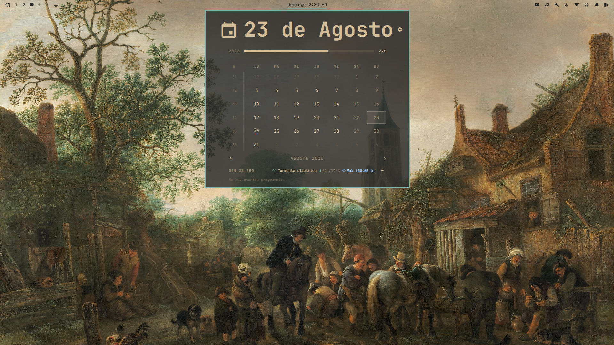

# 📅 Google Omarchalendar

<div align="center">


**Tu Google Calendar interactivo y pronóstico del clima directamente en la barra de Omarchy.**  
*An interactive Google Calendar widget with full event management, color coding, and hyper-local weather for Omarchy Desktop.*
This is a fork of this plugin https://github.com/tmn73/omarchy-calendar.git

[✨ Características](#-características--features) • [🚀 Instalación](#-instalación--installation) • [⚙️ Configuración](#️-configuración--settings) • [🌤️ Clima](#️-pronóstico-del-clima--weather-forecast) • [🔒 Privacidad](#-privacidad-y-seguridad--privacy--security)

---

</div>

## 🌟 Vista Previa / Preview

<div align="center">
  
</div>

Reemplaza el reloj tradicional de la barra para brindarte una experiencia completa:
* **Clic Izquierdo:** Despliega el calendario mensual con tus eventos reales, días festivos y agenda.
* **Barra interactiva:** Muestra la fecha/hora y avisa con antelación cuando tienes una reunión próxima.
* **Acceso rápido a videollamadas:** Botón directo para unirte a Google Meet o Zoom.

---

## ✨ Características / Features

- 📝 **Gestión interactiva de eventos:** Crea (`󰐕`), edita (`󰏫`) y elimina (`󰆴`) eventos de Google Calendar directamente desde el popup sin necesidad de abrir el navegador.
- 🎨 **Selector de colores oficial:** Asigna cualquiera de los 11 colores oficiales de Google Calendar (Lavanda, Salvia, Uva, Flamingo, Mandarina, Tomate, etc.) a tus eventos.
- 🌤️ **Pronóstico del clima integrado:** 
  - Condición actual con iconos Nerd Font (`󰖕`, `󰙾`, `󰖗`).
  - Temperatura máxima y mínima (°C).
  - Probabilidad de lluvia y hora exacta esperada del pico de lluvia (ej. `65% (16:00 h)`).
  - Selector de ciudad global con geocodificación automática (Open-Meteo).
- 🌐 **Soporte Bilingüe Completo (Español / English):**
  - Selector de idioma en tiempo real desde los ajustes.
  - Traducción completa de meses, días, agenda, modales y avisos de la barra.
- ⏰ **Anuncios inteligentes:** La barra te notifica de tus próximas reuniones con cuenta regresiva personalizable (5, 15, 30 min).
- 🗂️ **Soporte multi-calendario:** Oculta o muestra calendarios individuales fácilmente con puntos de color identificativos.
- 🧭 **Navegación por teclado:** Usa las flechas, `[`/`]`, `{`/`}`, `t` (ir a hoy) y `a` (añadir evento).
- 🔒 **100% Seguro y Privado:** Tus credenciales de Google OAuth residen únicamente en tu máquina local.

---

## 🚀 Instalación / Installation

### 1. Clonar o añadir como plugin en Omarchy

```bash
omarchy plugin add https://github.com/Layitt/GoogleOmarchalendar.git --enable
```

*O bien clonar manualmente en tu directorio de plugins:*
```bash
git clone https://github.com/Layitt/GoogleOmarchalendar.git ~/.config/omarchy/plugins/tmn73.calendar
```

### 2. Configurar en `~/.config/omarchy/shell.json`

Reemplaza la entrada de `omarchy.clock` por `tmn73.calendar` en tu archivo `~/.config/omarchy/shell.json`:

```json
{
  "bar": {
    "centerAnchor": "tmn73.calendar",
    "layout": {
      "center": [
        { 
          "id": "tmn73.calendar",
          "format": "dddd HH:mm"
        }
      ]
    }
  }
}
```

Luego, reinicia el shell:
```bash
omarchy restart shell
```

---

## 🔑 Sincronización con Google Calendar

Para vincular tu cuenta de Google Calendar de forma segura y privada, ejecuta el asistente de configuración interactivo:

```bash
~/.config/omarchy/plugins/tmn73.calendar/sync/setup
```

El script te guiará paso a paso para:
1. Crear un proyecto en tu [Google Cloud Console](https://console.cloud.google.com/).
2. Habilitar la Google Calendar API.
3. Descargar tu archivo `credentials.json` de tipo Aplicación de Escritorio (Desktop App).
4. Realizar la autenticación OAuth local y activar el temporizador de sincronización en segundo plano (`systemd`).

---

## ⚙️ Configuración / Settings

Haz clic en el icono de engranaje `󰒓` en la esquina superior derecha del calendario para acceder a:

| Ajuste | Descripción |
| :--- | :--- |
| **Idioma / Language** | Alterna al instante entre `Español` e `English`. |
| **Ubicación del Clima** | Escribe cualquier ciudad del mundo (ej. `Morelia`, `Madrid`, `Tokyo`) o `Auto` para detección por IP. |
| **Calendarios** | Activa o desactiva la visibilidad de tus calendarios sincronizados. |
| **Inicio de Semana** | Iniciar semanas en Lunes o Domingo. |
| **Avisos en la Barra** | Define con cuánta anticipación la barra anuncia el siguiente evento (Nunca, 5, 15, 30, 60 min). |

---

## 🌤️ Pronóstico del Clima / Weather Forecast

El plugin utiliza la API pública y gratuita de [Open-Meteo](https://open-meteo.com/) (sin necesidad de API keys) para ofrecer:
* **Detección horaria de lluvia:** Analiza las 24 horas del día seleccionado para indicarte la hora exacta en la que habrá mayor probabilidad de precipitación.
* **Geocodificación mundial:** Busca ciudades por nombre y zona horaria de forma automática.

---

## ⌨️ Atajos de Teclado / Shortcuts

Cuando el panel del calendario esté abierto:

| Tecla | Acción |
| :--- | :--- |
| `←` / `→` o `[` / `]` | Mes anterior / siguiente |
| `↑` / `↓` o `{` / `}` | Año anterior / siguiente |
| `t` / `T` | Volver al día de hoy |
| `w` / `W` | Alternar inicio de semana (Lunes / Domingo) |
| `a` / `A` | Abrir modal para crear nuevo evento |
| `Esc` | Cerrar modal o panel |

---

## 🔒 Privacidad y Seguridad / Privacy & Security

* **Sin intermediarios:** Todo el código se ejecuta 100% de manera local en tu máquina.
* **Tokens OAuth protegidos:** Las claves de acceso de Google se almacenan cifradas en tu llavero local del sistema (`keyring`) y en `~/.config/gws-omarchy-calendar/`.
* **Zero Tracking:** Ningún dato personal, correo o evento es enviado a servidores de terceros.

---

## 📄 Licencia / License

Distribuido bajo la Licencia **MIT**. Consulta el archivo `LICENSE` para más detalles.

---

<div align="center">
  Hecho con ❤️ para la comunidad de <b>Omarchy Desktop</b>.
</div>
